# Rectificación de notas  
  
Rectificación de Notas y Nota Extemporánea  
###  Vista Administrativa:  
  
Cronograma de Rectificación de Notas. En esta vista se crean los cronogramas y se el listado de todos los cronogramas activos e inactivos. Los campos de la tabla del listado de Cronogramas son: Nº, Periodo, Tipo Evaluación, Tipo Curso, Fecha Inicio, Fecha Fin, Estado, Detalle.  
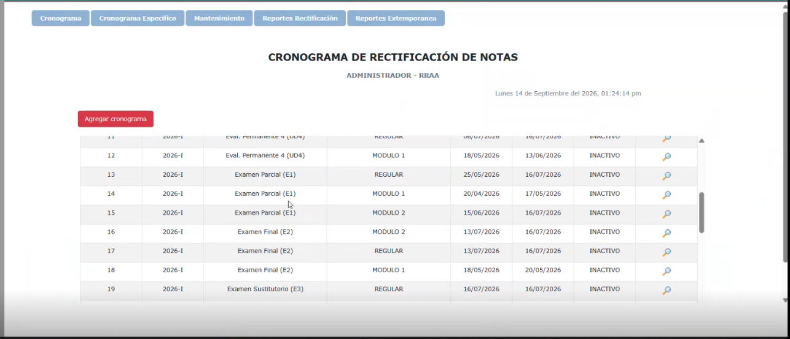  
  
El flujo inicia en la parte administrativa asignando fechas. En la interfaz hay un botón 'Agregar Cronograma' que levanta un modal para configurar: Periodo (2025-II, 2026-0, 2026-I, etc), Tipo de Evaluación, Tipo de Curso, Fecha Inicio y Fecha Fin.  
   
El select 'Tipo de evaluación' muestra las opciones:- Eval. Permanente 1 (UD1)- Eval. Permanente 2 (UD2)- Eval. Permanente 3 (UD3)- Eval. Permanente 4 (UD4)- Examen Parcial (E1)- Examen Final (E2)- Examen Sustitutorio (E3)Esto deja claro qué tipo de evaluación es la que se debe modificar.   
  
Tipo de curso: Regular Módulo 1, Módulo 2.  
   
Mientras esté activo, el Docente puede rectificar la nota.  
  
Mientras que la tabla que muestra todas las rectificaciones muestra los datos mencionados, pero además muestra el ‘Estado’ y ‘Detalle’, que básicamente muestra lo que configuramos en el form, que también permite editar/actualizar.  
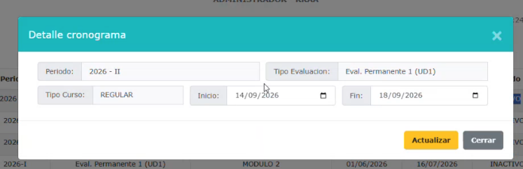  
  
Más abajo se ve la tabla con el listado de Cronogramas.Es en esta sección Admin donde se habilita el Periodo, y se especifica el tipo de evaluación, el cual se verá reflejado en el modal de ‘Solicitud de Rectificación de Nota’ del Docente.  
  
  
  
### Vista Docente:  
  
Inicia con la vista de filtros y el listado de solicitudes que realizó el docente. Muestra los filtros principales Periodo, Carrera, Tipo de Solicitud, Estado.  
  
Debajo hay un botón de ‘Agregar rectificación’ y otro de ‘Agregar Nota Extemporánea’  
  
Más abajo se muestra el listado de solicitudes con los datos:Nº, Tipo de solicitud, Ticket, Carrera, Periodo, Solicitante, Sección, Curso, Sesión, Tipo Evaluación, Estado (Solicitado, Rechazado, Procesado), Detalle (aquí se ve el Resumen de la solicitud).  
  
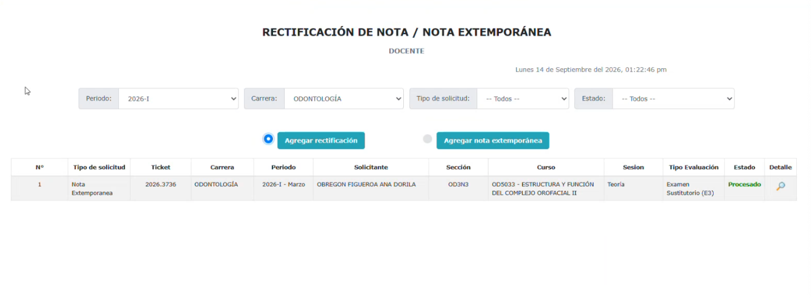  
  
Sobre el form/modal de ‘Solicitud de Rectificación de Nota’ para filtrar:  
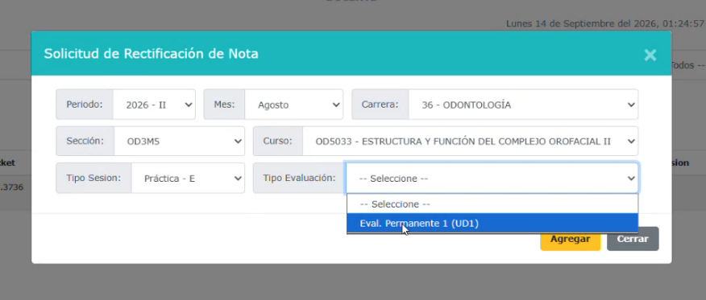  
  
Muestra los select: Periodo, Mes, Carrera, Sección, Curso, Tipo Sesión, Tipo Evaluación (la que configuramos en Admin). Al filtrar, en ese mismo modal, se carga la lista de alumnos con la siguiente tabla  
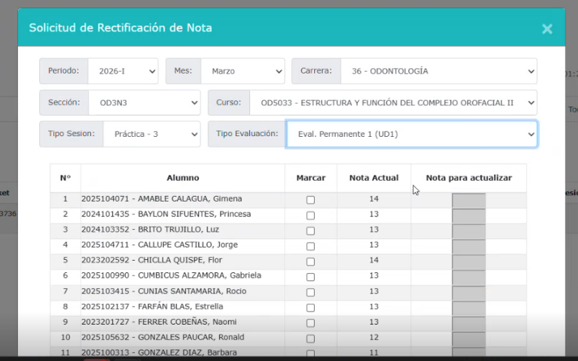  
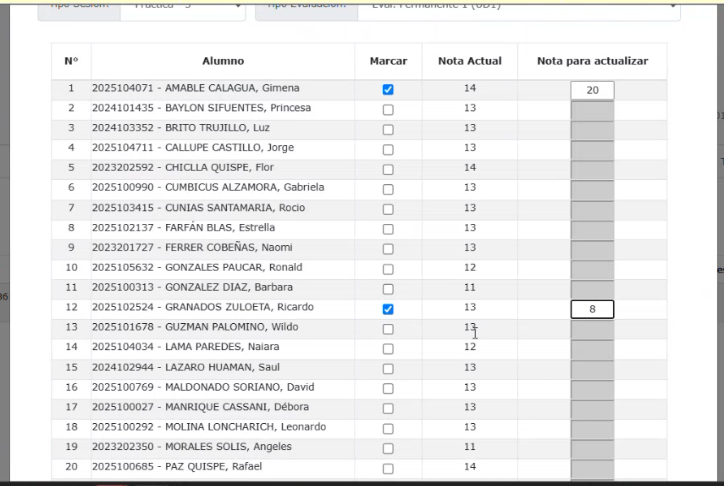  
La tabla muestra los datos Nº, Alumno (código + nombre completo), Marcar (Para marcar específicamente los alumnos), Nota Actual y la Nota para actualizar. (Se habilita siempre y cuando exista una nota ingresada)Al marcar las casillas de se habilitan los campos respectivos para actualizar  la calificación del alumno.Más abajo hay un select para elegir el motivo:   
- Error de cálculo de promedio  
- Error de digitación  
- Evaluación omitida  
- Revisión de examen  
- Redondeo aplicado  
- Error en ponderación  
- Error material  
- Corresponde NP  
- Otros  
  
Luego hay un campo de texto para describir el detalle motivo.  
  
Los botones de acción son ‘Agregar’ y ‘Cerrar’.  
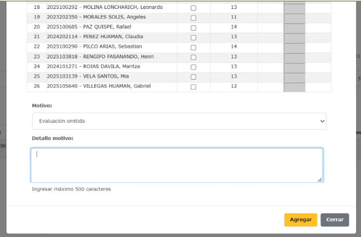  
  
Al darle al botón agregar se levanta un modal de confirmación con el texto:‘Estimado docente, le solicitamos verificar la exactitud de la nota registrada antes de proceder con su solicitud, dado que este cambio no está sujeto a una nueva corrección.’  
Botones: ‘Aceptar’ y ‘Cancelar’. Y luego el mensaje de ‘Registro Exitoso’ (ver cual es la mejor opción si modal o toast)  
  
Al guardar la información el modal se actualiza con una ‘vista resumen’, para esta fase de la solicitud (Solicitado), con dos secciones: la primera sección muestra el Ticket de la solicitud y el Estado. La segunda sección muestra la configuración/filtro previa y una tabla que muestra el listado de alumnos que tuvieron actualización de calificación (nota).  
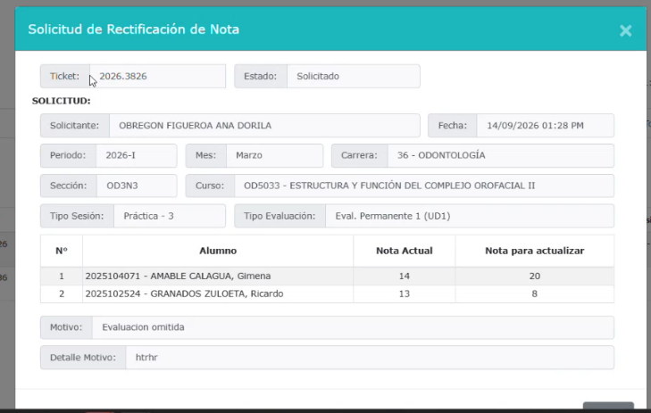  
Este modal solo tiene un botón de cerrar al final. Para volver a ver este modal se debe dar click a la ‘Lupa’ de la columna Detalle en el listado de solicitudes del Docente.Importante: Este mismo modal se reutiliza tanto para ver una Solicitud con estados ‘Solicitada’ y ‘Procesada’, mismos datos, con la diferencia que en los procesados, al final aparece una nueva sección EAP y muestra los campos: Atención(nombre del Director que aprueba o rechaza la solicitud), Fecha y Sustento (Campo de texto para redactar - como en la imagen de abajo).  
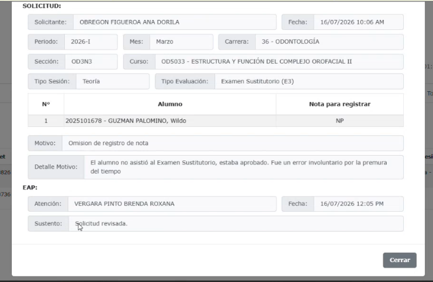  
Al cerrar el modal el docente debe volver a la vista de inicial y la tabla de solicitudes actualizada con la nueva solicitud con su respectivo estado (Solicitado).   
  
  
Sobre el form/modal de Registro de Nota Extemporánea:  
  
Usa un modal con los mismo campos que Rectificación de Nota (Periodo, Mes, Carrera, Sección, Curso, Tipo Sesión, Tipo Evaluación)  
  
*Importante: Para nota extemporánea, no se habilita con el Cronograma (de la vista Admin). Solo se habilita de acuerdo a la fecha del Cronograma de Evaluación (Sección Registro de Notas Docente - notas.html, en ‘schedule-card’). Quiere decir que para que se habilite una nota extemporánea, se debe haber pasado la fecha límite. Por ejemplo, Si la fecha límite es 20/09/2026, la nota extemporánea se habilita al día siguiente el 21, pasada la fecha límite. Mejor dicho, el select ‘Tipo de Evaluación’ va a listar todo lo que ya venció en ese Cronograma de Evaluación de la sección Registro de notas del perfil Docente.  
  
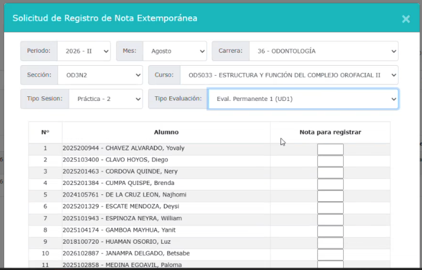  
Para este modal, la tabla de listado de alumnos cambia. Como no existe una calificación previa, solo aparece un campo para registrar la Nota. Y mantiene la misma regla que la sección de **Registro de Notas del perfil Docente**, se deben agregar todas las notas del listado para poder guardar; si no lo hace le salta un mensaje.   
Reutilizamos el modal de Rectificación de Notas solo que ajustamos las columnas del listado de alumnos.  
  
Para este caso, El motivo despliega otras opciones:  
- Cambio de docente  
- Demora en notas de práctica  
- Demora en promediar notas  
- Entrega tardía de trabajos  
- Falta de acceso / conectividad  
- Omisión de registro de nota  
- Reprogramación de clase  
- Otros  
  
Considerar en ambos escenarios un alumno con su row y casillas deshabilitadas permanentemente, para que se entienda que es un alumno retirado o suspendido.  
  
  
### Vista Director (Docente/Admin, dentro de la carpeta Administrativos):  
  
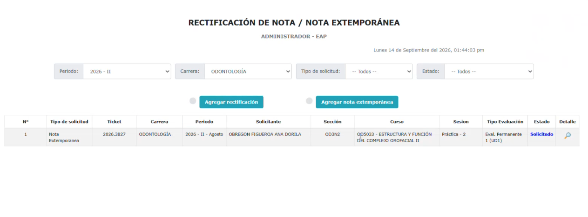  
En este perfil Admin, el usuario al ser también Director de escuela (son los que únicamente pueden aprobar o desaprobar estas solicitudes), también tiene las opciones de ‘Agregar rectificación’ y ‘Agregar nota extemporánea’. También muestra los filtros principales; Periodo, Carrera, Tipo de Solicitud, Estado.  
  
Y también muestra una tabla con el listado de solicitudes pendientes por responder.   
Al ingresar a revisar una solicitud con estado ‘Solicitado’, se reutiliza el modal de Resumen, con la diferencia que ahora muestra los botones Procesar y Rechazar, además de un campo de texto para describir el Detalle/Sustento. No se puede procesar a menos que ingreses el sustento.Si el Directivo rechaza, al procesar y actualizarse la vista Resumen, aparece un botón de ‘Cancelar’ que se mantiene activo por 15 minutos. Si cancela, se resetea. Y vuelven a aparecer los botones y el campo para ingresar el sustento. Debemos buscar, otro nombre u otra forma de retrotraer. Busca algo más funcional, con mejor UX writing. Algo que haga más evidente la acción de resetear el rechazo.  
  
Si el directivo Aprueba/Procesa, el registro se actualiza de forma automática. Previamente salta un modal de confirmación con el texto ‘Estimado Director, recuerde que, una vez que usted apruebe esta solicitud, el cambio será procesado automáticamente en el sistema de notas. Por favor, revise los detalles antes de procesar la rectificación de nota’. (Para el caso de Rectificación de Nota). Considerar el toast Registro Exitoso o Rechazado según decida el Directivo.  
  
Considera que se reutiliza la estructura del modal de Resumen para todos los perfiles. Mantengamos consistencia en la construcción de componentes.   
  
  
  
  
  
  
  
  
  
  
  
  
  
  
  
  
  
  
  
  
  
  
  
  
  
  
  
  
  
  
  
  
  
  
  
  
  
  
  
  
  
  
  
  
  
  
  
  
  
  
  
  
  
  
  
